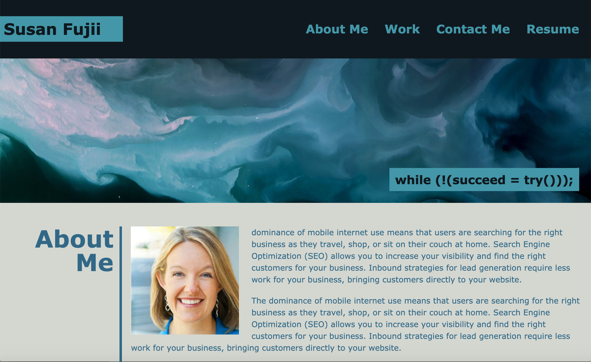
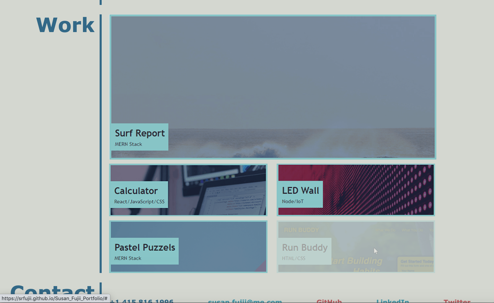
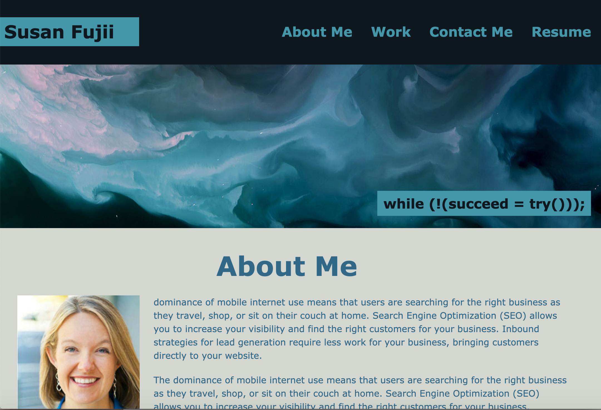
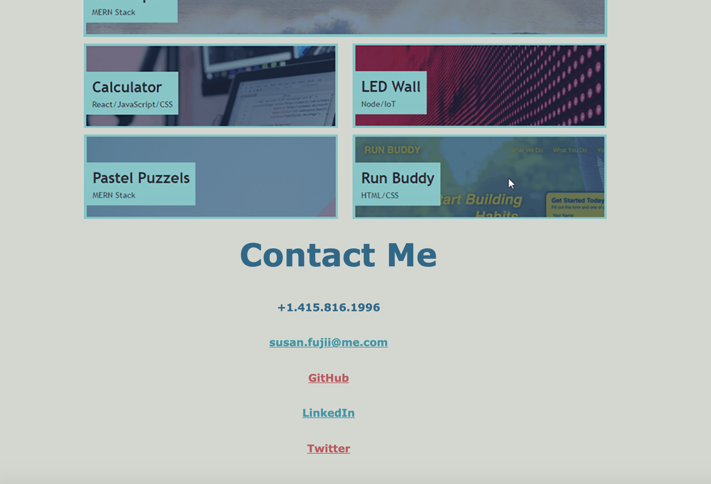
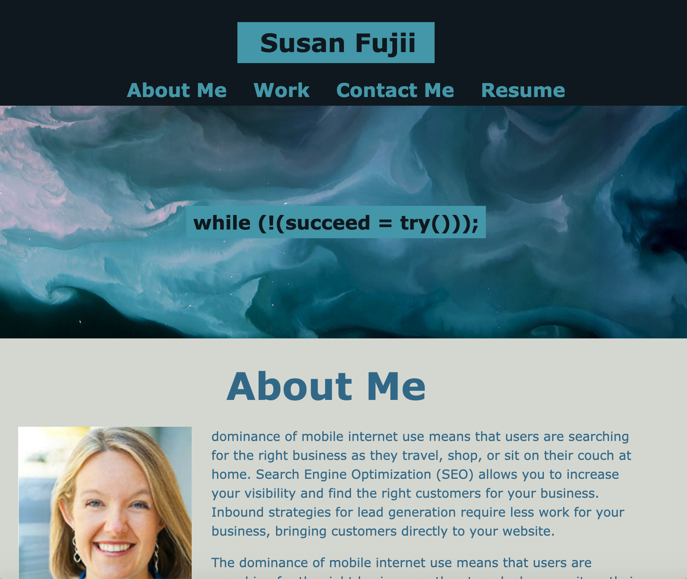
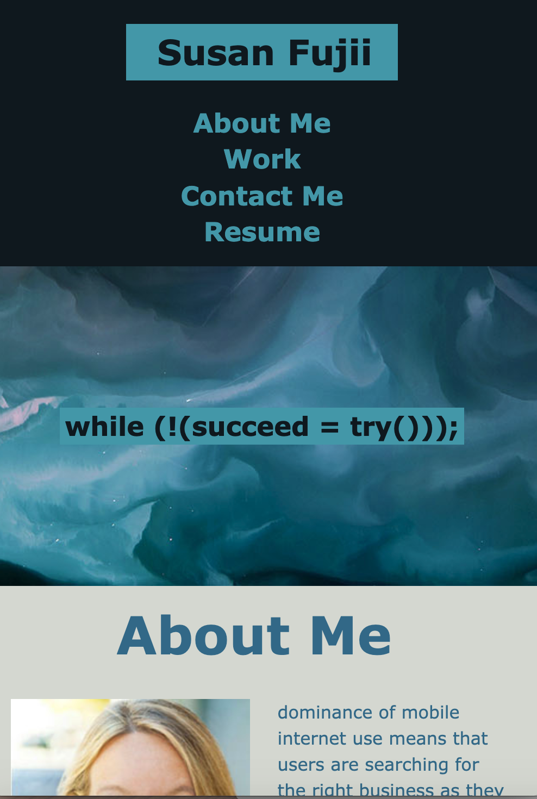
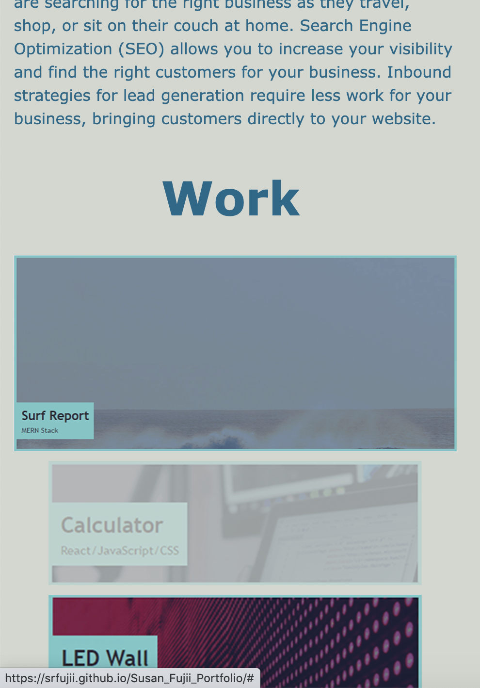
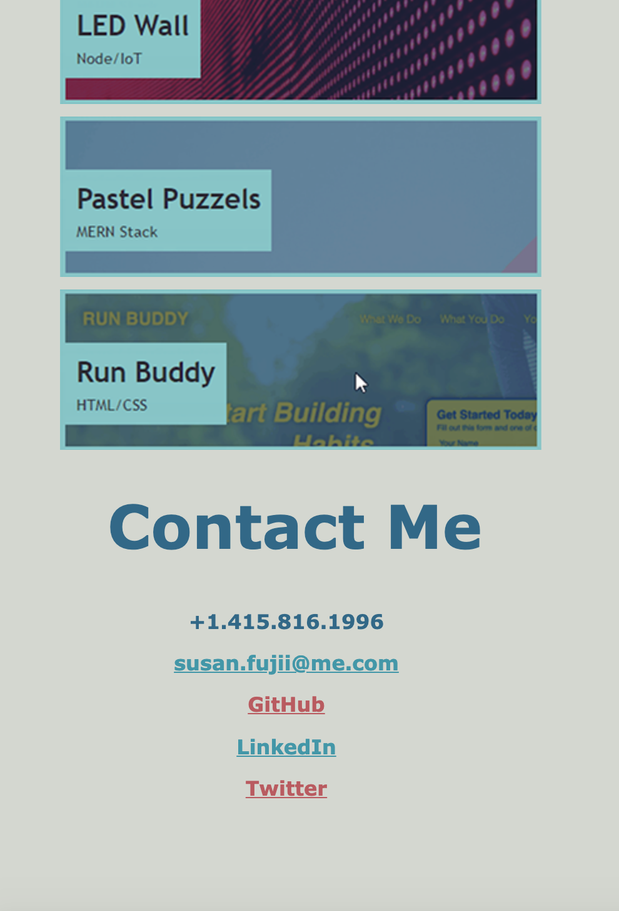

# Susan Fujii's Online Portfolio and Resume

## Table of Contents

- [Description](#Description)
- [Motivation](#Motivation)
- [Why I Built This](#Why-I-Built-This)
- [Problem I am Solving](#The-Problem-I-am-Solving)
- [What I Learned](#What-I-Learned)
- [Installation](#Installation)
- [Usage](#Usage)
- [Screenshots](#Screenshots)
- [Credits](#Credits)
- [License](#License)
- [Features](#Features)
- [Contribute](#How-to-Contribute)

## Description

The purpose of this project is to **create a web application from scratch** that can be used as an online portfolio of work to share with potential employers.

### Motivation

A portfolio of work is used to showcase skills and talents to employers who are looking to fill a part-time or full-time position. An effective portfolio highlights our strongest work as well as our thought processes behind it. Having several live, deployed projects is a minimum requirement to receive an initial interview at many companies, so it is very important to build an online portfolio! 

### Why I Built This

With these points in mind, in this project I am attempting to set myself up for future success by applying the core skills I've recently learned: flexbox, media queries, and CSS variables.

I've initially included only placeholder images and blank links for my "live projects" as this is my first web application, but I plan to replace them with real projects as I create more in my web development journey.

Additionally, I wanted this web application to be **accessible** to users who will view it both on larger computer screens and also on smaller screen sizes, and for the code to be **up to current industry standards** and **use best known practices**.

**Accessibility** is an increasingly important consideration for businesses. Web accessibility ensures that people with disabilities can access a website using assistive technologies like video captions, screen readers, and braille keyboards. **Accessible** sites also rank higher in search engines and ensure that **all** users can easily access the information provided.

### The Problem I am Solving

Before I created this online portfolio, I had no way to show potential employers my skills and live work samples. This online portfolio will allow me to:

1. Link to my resume (once it's completed)
2. Showcase my live, working public projects
3. Showcase my HTML and CSS skills
4. Tell potential employers a bit about myself
5. Link to my LinkedIn, Twitter, and other social accounts
6. Show that I understand and implement accessibility and responsive design.

### What I Learned

This was a fun project! I loved trying to match my code to the given mockup as closely as I could, while ensuring everything was functional to the given standards and looked good on multiple screen sizes.

I learned that there are **many different CSS positioning methods, each more or less appropriate in different circumstances**. For example, for my global navigation I originally used what was shown for our first Horiseon project (float:right). This worked and looked fine on my large laptop screen, but completely fell apart on smaller screen sizes. I then **changed my global navigation to a flexbox** and it was MUCH easier to style for various screen sizes!

But **flexboxes weren't the "magic answer" for every element of this design**...for example in the outer main content creator, I had originally decided and attempted to use multiple nesting flexboxes-- one for the outer container, another for the work samples, and another for the contact me information. This would probably work in theory, however I became hopelessly confused trying to determine which display:flex element was aligned where/how and how to get all of the appropriate spacing correct!

So, I did a little more digging, because **for the outer container I really wanted and needed something like a traditional table, with two columns and three rows**, with the ability to have those columns and rows line up like traditional Excel table columns and rows with appropriate cell padding and cell spacing in between. Luckily, there IS another CSS positioning feature called the **CSS grid layout**, which does just that! So, I changed my outer main content container to use grid styling and everything became MUCH simpler and much easier to understand and work with. 

With those changes, I had **grid styling where I needed it, and separate flexboxes where needed to flow naturally when screens are resized.** 

I also did my best to use current HTML 5 semantic code and to comment everything as well as possible...as much for myself when I go back to add and edit this portfolio in the future, as well as for "other developers" (who will probably not ever desire to "collaborate" on my personal portfolio).  :-)

In the end, my finished code accomplishes this project's objectives and is hopefully a great starting point for my online portfolio.

## Installation
To view this project, simply visit (https://srfujii.github.io/Susan_Fujii_Portfolio)
 
To install this project on your local machine, simply visit this repo at (https://github.com/srfujii/Susan_Fujii_Portfolio) and use git to clone it to your local environment.

## Usage
This single-page website is quite easy to navigate. Simply click on the top navigation links jump to the section you are interested in. The resume opens my resume (actually a sample resume...thank you Dan Clark) :-) in PDF format in a new tab.

## Screenshots
Here are some screenshots for you to preview how my portfolio looks at different screensizes:

### Large Screen Sizes:
    
    
    

### Medium Screen Sizes:
    
    

### Small Screen Sizes:
    

### Tiny Screen Sizes:
    
    
    

## Credits

1. [Rice Technology Bootcamp](https://techbootcamps.rice.edu/)

### Grid/Flexbox Resources:

1. [An Example of Nesting Flexbox inside CSS Grid](https://codepen.io/jensimmons/pen/LyrNqJ)
2. [Mastering Wrapping of Flex Items - CSS: Cascading Style Sheets | MDN](https://developer.mozilla.org/en-US/docs/Web/CSS/CSS_Flexible_Box_Layout/Mastering_Wrapping_of_Flex_Items)
3. [CSS Grid Layout - CSS: Cascading Style Sheets | MDN](https://developer.mozilla.org/en-US/docs/Web/CSS/CSS_Grid_Layout)
4. [Basic Concepts of grid layout - CSS: Cascading Style Sheets | MDN](https://developer.mozilla.org/en-US/docs/Web/CSS/CSS_Grid_Layout/Basic_Concepts_of_Grid_Layout)
5. [CSS Grid Layout](https://www.w3schools.com/css/css_grid.asp)
6. [A Complete Guide to Flexbox | CSS-Tricks](https://css-tricks.com/snippets/css/a-guide-to-flexbox/)
7. [How Flexbox works — explained with big, colorful, animated gifs](https://www.freecodecamp.org/news/an-animated-guide-to-flexbox-d280cf6afc35/)

### General HTML/CSS Resources:

1. [What is the difference between Normalize.css and Reset CSS? - Stack Overflow](https://stackoverflow.com/questions/6887336/what-is-the-difference-between-normalize-css-and-reset-css)
2. (https://necolas.github.io/normalize.css/8.0.1/normalize.css)
3. [html - The Most Efficient CSS Selector: Header Tag, Class or ID? - Stack Overflow](https://stackoverflow.com/questions/14156362/the-most-efficient-css-selector-header-tag-class-or-id)
4. [How To Create Image Hover Overlay Effects](https://www.w3schools.com/howto/howto_css_image_overlay.asp)

## License
[MIT License](./license.txt)

## Features

<ol>
    <li>Semantic HTML implemented in HTML and CSS</li>
    <li>ELements follow logical structure</li>
    <li>All images have accessible alt tags</li>
    <li>Comments added before each CSS element and HTML section</li>
    <li>All hyperlinks work (except where intentionally left blank)</li>
    <li>Title is concise and descriptive</li>
    <li>When portfolio is loaded user is presented with my name, a recent photo, and links to sections about me, my work, and how to contact me</li>
    <li>When global navigation links are clicked, the UI scrolls to the corresponding section</li>
    <li>When the "Work" section is presented, the latest-and-greatest first application is larger than the other work samples</li>
    <li>When Work sample image links are hovered over, the user is provided with a visual cue to show which image link their cursor is over</li>
    <li>When the portfolio is resized or viewed on various screens and devices, the responsive layout adapts to the user's screensize</li>
</ol>

## How to Contribute

